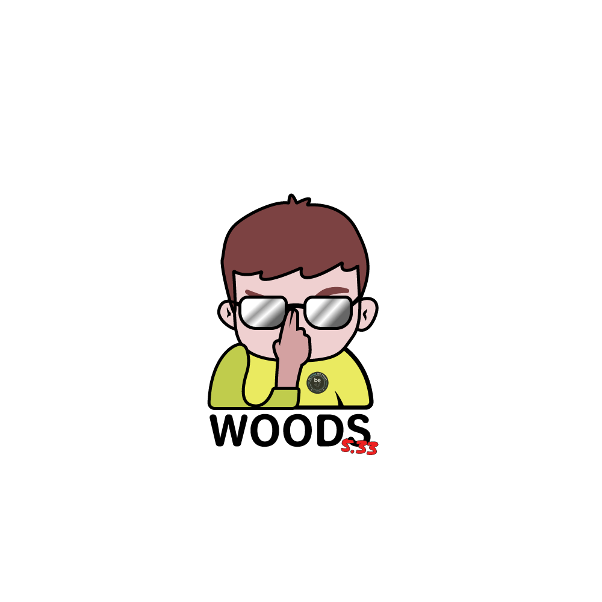

### *Hi there*  I'm Kawtagan 👋

**Join me**

---

- 🔭 I’m currently working on something secret :speak_no_evil:
- 🌱 I’m currently learning REACT
- ⚡ Fun fact: I am constantly hungry...
- :thought_balloon: Ask me about anything, i'm glad to help you !
- :love_letter: How to reach me: rberthaux@gmail.com 

---
## **Languages** :lips:

## **Softwares** :skull: 

---

## :trollface: Latest Tech Talk Post

*About Stylus* => https://www.canva.com/design/DAExYGF8Prs/share/preview?token=82nffqpqirSp2W3cbx3GqA&role=EDITOR&utm_content=DAExYGF8Prs&utm_campaign=designshare&utm_medium=link&utm_source=sharebutton

*About Macintosh* => https://spark.adobe.com/page/fOGTz7gGdaY9q/?fbclid=IwAR3Nu2pI_WqXuReQbIBHTUC_9OvjwhClK-ldG0unyfmoMx2s-qZtqEpcL18

*About Adobe XD* => https://spark.adobe.com/page/WUYBj8yO3cN2P/?fbclid=IwAR1yzzwN7uOxHE3UzrPSgn4B7DoY3wNJA8tgQAVz5n3-mGGnWZ1OrsMflZU

---

